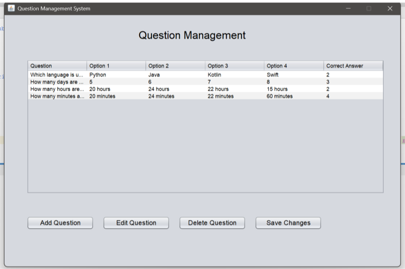
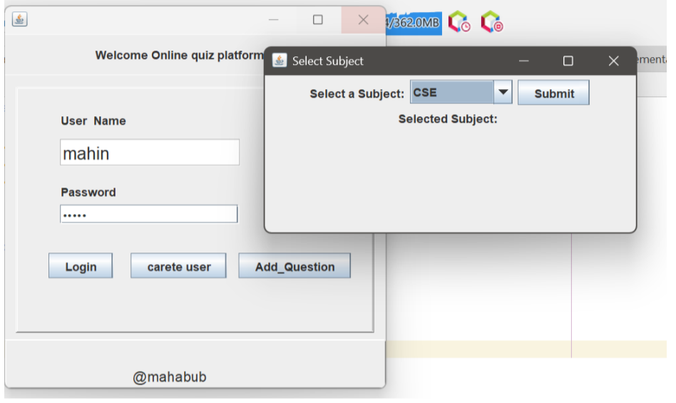
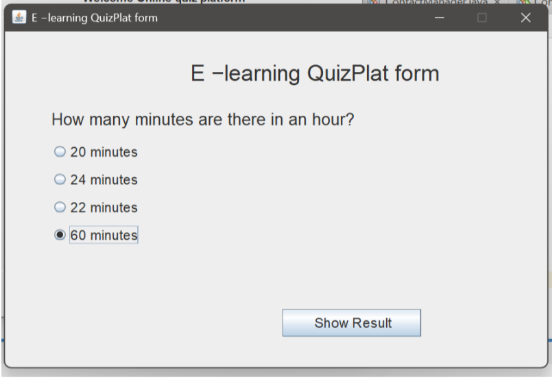
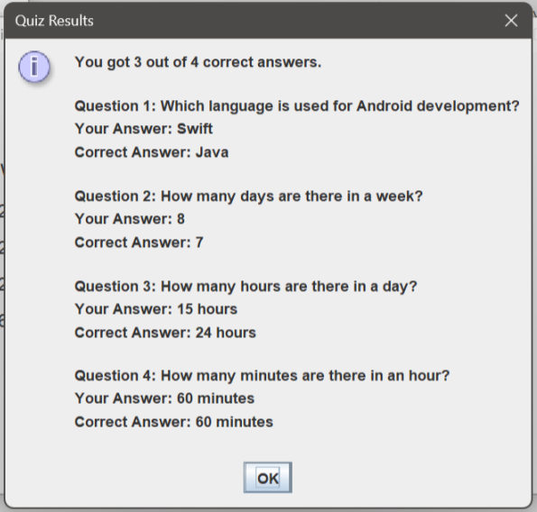

# 📚 E-Learning Quiz Platform (Java & MySQL)

An interactive, desktop-based examination and quiz management application built using **Java (Swing & AWT)** and **MySQL Database**. The platform allows administrators to manage users and question banks via complete CRUD operations, while enabling students to select subjects, take timed multiple-choice quizzes, and receive instant score breakdowns with question-by-question answer reviews.

> 📄 **Project Documentation:** [View Full Project Lab Report (PDF)](docs/E_Learning_Quiz_Platform.pdf)

---

## 📸 Application Workflow & Screenshots

### 1. User Authentication & Account Management
| Figure 1: User Login Screen | Figure 2: User Management Dashboard (CRUD) |
| :---: | :---: |
|  |  |
| *Login interface with credential validation and role navigation.* | *Manage system users with real-time JTable view, Add, Edit, and Delete.* |

---

### 2. Question Management & Subject Selection
| Figure 3: Question Management Dashboard | Figure 4: Subject Selection Modal |
| :---: | :---: |
|  |  |
| *Question bank table with options to Add, Edit, Delete, and Save MCQs.* | *Dropdown dialog to filter and select quiz subject before starting.* |

---

### 3. Interactive Quiz & Instant Score Evaluation
| Figure 5: Active Quiz Interface | Figure 6: Result & Answer Breakdown Review |
| :---: | :---: |
|  |  |
| *Dynamic MCQ question loader with single-choice Radio Button groups.* | *Automated grading dialog displaying score and comparing user vs. correct answers.* |

---

## 🚀 Key Features

### 🔐 User & Authentication Management (`login.java`, `Users.java`)
- **Secure Authentication**: Validates user credentials directly against the MySQL database.
- **Full User CRUD**: Interactive table (`JTable`) displaying all registered users with real-time operations:
  - Add/Register new user accounts.
  - Edit existing credentials with confirmation prompts.
  - Delete user records with dynamic table row updates.

### 📝 Question Bank Administration (`Questions_add.java`)
- **Comprehensive Question Dashboard**: Tabular display showing Question text, Options 1 to 4, and the correct option index.
- **Interactive Modals**:
  - **Add Question**: Form dialog to input questions, four choices, and the correct answer index (1–4).
  - **Edit Question**: Pre-populated update modal to modify question parameters in the database.
  - **Delete Question**: Removes questions safely with confirmation checks.

### 🧠 Dynamic Quiz Engine & Grading (`Questions.java`)
- **Automated Question Loader**: Dynamically fetches questions and choices from the database.
- **Radio Button Selection**: Grouped radio buttons (`ButtonGroup`) ensuring only one valid answer can be picked per question.
- **Real-Time Score Calculation**: Tracks correct responses behind the scenes as the candidate progresses.
- **Comprehensive Result Breakdown**: Modal dialog displaying:
  - Total score achieved (e.g., *"You got 3 out of 4 correct answers"*).
  - Detailed side-by-side analysis showing the user's selected option versus the actual correct answer.
- **Completion Confirmation**: Displays an integrated "Thank You" confirmation window upon finishing.

---

## 🛠️ Technology Stack

| Component | Technology / Library |
|---|---|
| **Programming Language** | Java SE 8+ |
| **GUI Framework** | Java Swing & AWT (`JFrame`, `JPanel`, `JTable`, `JRadioButton`, `JOptionPane`) |
| **Database** | MySQL |
| **Database Connectivity** | JDBC (MySQL Connector/J) |
| **Development IDE** | NetBeans IDE |

---

## 🗄️ Database Schema & SQL Setup

Create the database and execute the following SQL scripts in your MySQL server (phpMyAdmin / MySQL Workbench):

```sql
CREATE DATABASE IF NOT EXISTS quiz_platform;
USE quiz_platform;

-- 1. Users Table
CREATE TABLE IF NOT EXISTS users (
    id INT AUTO_INCREMENT PRIMARY KEY,
    username VARCHAR(255) NOT NULL UNIQUE,
    password VARCHAR(255) NOT NULL
);

-- 2. Subjects Table
CREATE TABLE IF NOT EXISTS subjects (
    id INT AUTO_INCREMENT PRIMARY KEY,
    name VARCHAR(255) NOT NULL UNIQUE,
    description TEXT,
    created_at TIMESTAMP DEFAULT CURRENT_TIMESTAMP
);

-- 3. Questions Table
CREATE TABLE IF NOT EXISTS question (
    id INT AUTO_INCREMENT PRIMARY KEY,
    subject_id INT DEFAULT 1,
    question TEXT NOT NULL,
    option_1 VARCHAR(255) NOT NULL,
    option_2 VARCHAR(255) NOT NULL,
    option_3 VARCHAR(255),
    option_4 VARCHAR(255),
    correct_answer INT NOT NULL CHECK (correct_answer BETWEEN 1 AND 4),
    created_at TIMESTAMP DEFAULT CURRENT_TIMESTAMP
);

-- Sample Data Insertion
INSERT INTO question (question, option_1, option_2, option_3, option_4, correct_answer) VALUES
('Which language is used for Android development?', 'Python', 'Java', 'Kotlin', 'Swift', 2),
('How many days are there in a week?', '5', '6', '7', '8', 3),
('How many hours are there in a day?', '20 hours', '24 hours', '22 hours', '15 hours', 2),
('How many minutes are there in an hour?', '20 minutes', '24 minutes', '22 minutes', '60 minutes', 4);
```

---

## 📂 Project Structure

```text
E-Learning-Quiz-Platform/
├── docs/
│   └── E_Learning_Quiz_Platform.pdf       # Academic project lab report
├── screenshots/
│   ├── 01-login-screen.png                # Login Window
│   ├── 02-user-crud.png                   # User Management CRUD
│   ├── 03-question-management.png         # Admin Question Management
│   ├── 04-subject-selection.png           # Subject Selection Modal
│   ├── 05-quiz-interface.png              # Active Quiz Screen
│   └── 06-quiz-result.png                 # Detailed Score & Feedback
├── src/
│   └── quizzes/
│       ├── Quiz_Platform.java             # Application Entry Point
│       ├── login.java                     # Login GUI & Authentication logic
│       ├── Users.java                     # User Management CRUD JFrame
│       ├── Questions_add.java             # Admin Question Manager & Modal Dialogs
│       └── Questions.java                 # Interactive Quiz Engine & Result Generator
└── README.md
```

---

## ⚙️ How to Setup & Run

### Prerequisites
1. **Java Development Kit (JDK 8 or higher)** installed.
2. **MySQL Server** (via XAMPP, WAMP, or standalone MySQL Server) running on port `3306`.
3. **MySQL Connector/J (JDBC Driver)** `.jar` file added to the project classpath.

### Setup Steps
1. **Clone the Repository**:
   ```bash
   git clone [https://github.com/mahabubhasanmahin/E-Learning-Quiz-Platform-Java-MySQL-.git](https://github.com/mahabubhasanmahin/E-Learning-Quiz-Platform-Java-MySQL-.git)
   cd E-Learning-Quiz-Platform-Java-MySQL-
   ```

2. **Database Configuration**:
   - Start MySQL and import the SQL queries provided in the **Database Schema** section above.
   - Verify connection settings in `login.java`, `Users.java`, `Questions_add.java`, and `Questions.java`:
     ```java
     String url = "jdbc:mysql://localhost:3306/quiz_platform";
     String username = "root";
     String password = ""; // Enter your MySQL root password if set
     ```

3. **Run from NetBeans IDE**:
   - Open NetBeans IDE.
   - Go to **File** $\rightarrow$ **Open Project** and select the cloned folder.
   - Right-click on **Libraries** $\rightarrow$ **Add JAR/Folder** $\rightarrow$ select `mysql-connector-java.jar`.
   - Right-click on `Quiz_Platform.java` $\rightarrow$ click **Run File** (or press `Shift + F6`).

---

## 🔮 Future Enhancements

- **Password Security**: Implement BCrypt hashing to store salted password hashes instead of plain text.
- **Timer Integration**: Add a countdown timer per question or overall quiz session.
- **User History & Leaderboard**: Store student score records in a `results` table to generate historical progress reports.
- **Modern Interface**: Migrate desktop Swing components to JavaFX or a web stack (Spring Boot & React).

---

## 👥 Contributors & Academic Information

- **MD MAHABUB HASAN MAHIN** — ID: 231902056

*Department of Computer Science and Engineering (CSE)*  
*Green University of Bangladesh*  
*Course: CSE 210 - Database Lab (Fall 2024)*
