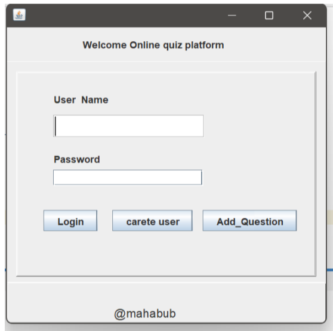
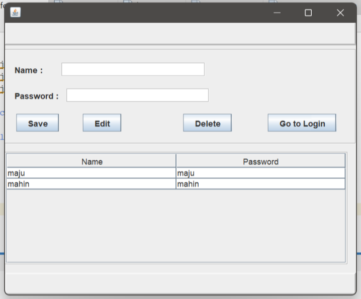

# 📚 E-Learning Quiz Platform (Java & MySQL)

A desktop-based learning management and quiz platform module built using **Java (Swing & AWT)** and **MySQL Database**. This repository contains the core authentication system, user management dashboard (CRUD), and subject/topic selection architecture developed in NetBeans IDE.

> 📄 **Project Documentation:** [View Full Lab Report (PDF)](docs/E_Learning_Quiz_Platform.pdf)

---

## 📸 Application Workflow & Screenshots

### 1. User Authentication & Profile Management
| User Login Interface | User Management Dashboard (CRUD) |
| :---: | :---: |
|  |  |
| *User login window validating credentials via MySQL database.* | *Manage users with live table records (Add, Edit, and Delete).* |

---

### 2. Subject & Topic Navigation
| Topic / Subject Selection Interface |
| :---: |
|  |
| *Category and subject selection window loaded after successful user login.* |

---

## 🚀 Implemented Features

### 🔐 1. Authentication System (`login.java`)
- User verification against records stored in the MySQL database.
- Input validation for username and password fields.
- Direct navigation options to Register User (`newuser`) and proceed to the Topic Dashboard.

### 👤 2. User Management System (`Users.java`)
- **Interactive JTable**: Live tabular view fetching and displaying registered users.
- **Create**: Register new student/admin accounts.
- **Update**: Edit existing user credentials with confirmation dialogs.
- **Delete**: Remove user accounts safely from the database.

### 🗂️ 3. Topic Architecture (`Topics.java`)
- Topic selection and categorisation structure for quiz subjects.
- Designed as the navigation gateway between login and the quiz modules.

---

## 🛠️ Technologies Used

- **Language**: Java SE 8+
- **GUI Framework**: Java Swing & AWT (NetBeans GUI Builder `.form`)
- **Database**: MySQL Server
- **Connectivity**: JDBC (MySQL Connector/J)
- **IDE**: NetBeans IDE

---

## 📂 Project Structure

```text
E-Learning-Quiz-Platform/
├── docs/
│   └── E_Learning_Quiz_Platform.pdf   # Complete academic lab report
├── screenshots/
│   ├── 01-login-screen.png            # Login screen
│   ├── 02-user-crud.png               # User management table
│   └── 03-topic-selection.png         # Topic selection window
├── src/
│   └── quizzes/
│       ├── Quiz_Platform.java         # Main application entry point
│       ├── login.java                 # Login controller & database authentication
│       ├── login.form                 # NetBeans UI design form for login
│       ├── Users.java                 # User registration & CRUD dashboard
│       ├── Users.form                 # NetBeans UI design form for Users
│       ├── Topics.java                # Topic & subject selection UI
│       └── Topics.form                # NetBeans UI design form for Topics
└── README.md
```

---

## 🗄️ Database Setup

Run the following SQL commands in MySQL (phpMyAdmin or MySQL Workbench):

```sql
CREATE DATABASE IF NOT EXISTS quiz_platform;
USE quiz_platform;

-- 1. Users Table
CREATE TABLE IF NOT EXISTS users (
    id INT AUTO_INCREMENT PRIMARY KEY,
    username VARCHAR(255) NOT NULL UNIQUE,
    password VARCHAR(255) NOT NULL
);

-- 2. Subjects / Topics Table
CREATE TABLE IF NOT EXISTS subjects (
    id INT AUTO_INCREMENT PRIMARY KEY,
    name VARCHAR(255) NOT NULL UNIQUE,
    description TEXT,
    created_at TIMESTAMP DEFAULT CURRENT_TIMESTAMP
);

-- Sample Data
INSERT INTO users (username, password) VALUES 
('mahin', '1234'),
('maju', '1234');

INSERT INTO subjects (name, description) VALUES 
('CSE', 'Computer Science & Engineering Topics');
```

---

## ⚙️ How to Run

### Prerequisites
- JDK 8 or higher installed
- MySQL Server (XAMPP / WAMP / MySQL Standalone) running on port `3306`
- NetBeans IDE

### Steps
1. **Clone the Repository**:
   ```bash
   git clone [https://github.com/mahabubhasanmahin/E-Learning-Quiz-Platform-Java-MySQL-.git](https://github.com/mahabubhasanmahin/E-Learning-Quiz-Platform-Java-MySQL-.git)
   ```

2. **Open Project in NetBeans**:
   - Open NetBeans $\rightarrow$ **File** $\rightarrow$ **Open Project** $\rightarrow$ Select this folder.

3. **Add MySQL Driver**:
   - Right-click **Libraries** $\rightarrow$ **Add JAR/Folder** $\rightarrow$ Add `mysql-connector-j.jar`.

4. **Verify Database Configuration**:
   - Check connection credentials in `login.java` and `Users.java`:
     ```java
     String url = "jdbc:mysql://localhost:3306/quiz_platform";
     String username = "root";
     String password = ""; // Enter your MySQL password if any
     ```

5. **Run the Application**:
   - Right-click `Quiz_Platform.java` $\rightarrow$ **Run File** (or press `Shift + F6`).

---

## 🔮 Scope of Future Work

- **Password Hashing**: Implement BCrypt hashing to secure credentials instead of plain text.
- **Dynamic Quiz Engine**: Integrate question bank generation and real-time score evaluations directly into the GUI.
- **Timer & Analytics**: Add timed quiz sessions and an admin analytics dashboard.

---

## 👥 Contributors

- **MD MAHABUB HASAN MAHIN** — ID: 231902056

*Department of Computer Science and Engineering (CSE)*  
*Green University of Bangladesh*  
*Course: CSE 210 - Database Lab*
